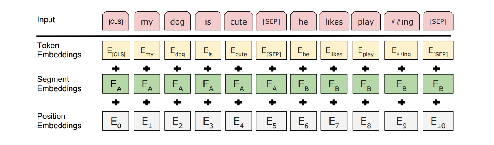
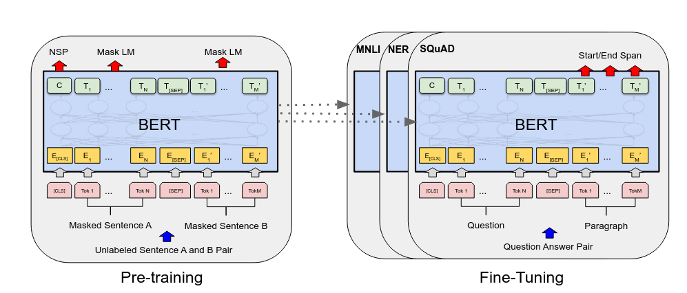

# BERT: Pre-training of Deep Bidirectional Transformers for Language Understanding

## Core Innovation
**Deep bidirectional context** through joint conditioning on left/right context in all layers, overcoming limitations of:
- ELMo's shallow concatenation
- GPT's unidirectional approach

## Key Architecture Components
### Model Specifications
| Parameter        | BERT-Base | BERT-Large |
|------------------|-----------|------------|
| Layers           | 12        | 24         |
| Hidden Dimension | 768       | 1024       |
| Attention Heads  | 12        | 16         |
| Total Parameters | 110M      | 340M       |

### Input Representation
  
*Three embedding types summation*

1. **Token Embeddings**: WordPiece (30k vocabulary)
2. **Segment Embeddings**: Sentence A/B differentiation
3. **Position Embeddings**: Learned positional encoding

Special tokens:
- `[CLS]`: Classification token
- `[SEP]`: Sentence separator

---

  
*Pre Training- Fine Tuning Modelling*

## Pre-training Tasks

### 1. Masked Language Modeling (MLM)

- **15% tokens masked** per sequence
- **Masking Strategy**:
  - 80% → `[MASK]`
  - 10% → Random token
  - 10% → Original token
- Solves pretraining-finetuning mismatch

### 2. Next Sentence Prediction (NSP)
- **Binary classification task**:
  - 50% actual consecutive sentences
  - 50% random sentence pairs
- Trains relationship understanding between text spans

---

## Training Details
### Data Sources
- BooksCorpus (800M words)
- English Wikipedia (2,500M words)

### Technical Specifications
- Training Hardware: 16 TPU pods
- Batch Size: 256 sequences × 512 tokens
- Adam Optimization (β₁=0.9, β₂=0.999)

---

## Fine-tuning Approach

**Task-Specific Adaptations**:
1. **Single Sentence Tasks**  
   Use `[CLS]` token output for classification

2. **Sentence Pair Tasks**  
   Separate with `[SEP]` + segment embeddings

3. **Token-Level Tasks**  
   Use final hidden states directly

---

## Impact & Results
| Benchmark        | BERT-Large | Previous SOTA | Improvement |
|------------------|------------|---------------|-------------|
| GLUE             | 80.4%      | 72.7%         | +7.7%       |
| SQuAD v1.1 (F1)  | 93.2       | 91.6          | +1.6        |
| SWAG             | 86.3%      | 59.9%         | +26.4%      |

---

## Legacy & Evolution
**BERT's Influence**:
- RoBERTa (Optimized pretraining)
- ALBERT (Parameter efficiency)
- DistilBERT (Knowledge distillation)

---

## Ethical Considerations
1. **Training Data**: BookCorpus gender/cultural biases
2. **Carbon Footprint**: ~1,500 kg CO₂ equivalent
3. **Environmental Impact**: 79 kWh per training hour

---

## Further Reading
1. Original Paper: [arXiv:1810.04805](https://arxiv.org/abs/1810.04805)
2. Official GitHub: [google-research/bert](https://github.com/google-research/bert)
3. HuggingFace Implementation: `transformers.BertModel`
