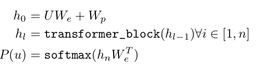
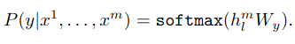
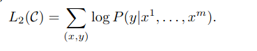
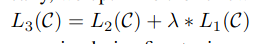
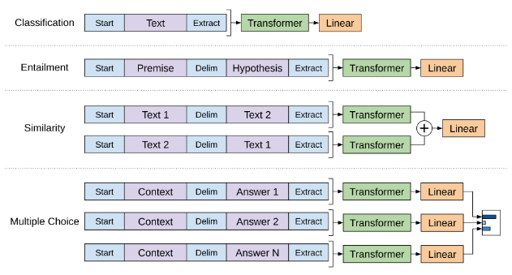
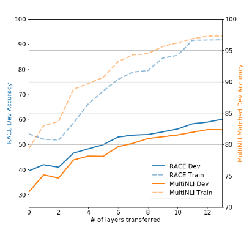
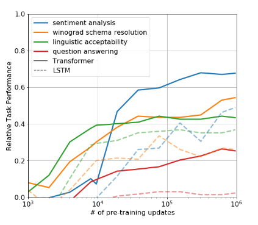

# Technical Primer: Improving Language Understanding by Generative Pre-Training (GPT-1)

## Abstract
This work demonstrates the effectiveness of generative pre-training followed by discriminative fine-tuning for natural language understanding tasks. Our approach achieves state-of-the-art results on 9 of 12 benchmarks using a task-agnostic transformer architecture, with absolute improvements up to 8.9% on commonsense reasoning and 5.7% on question answering[1].

## 1. Introduction
Key innovations:
- First application of transformer architecture for unsupervised pre-training
- Task-specific input transformations enabling minimal architectural changes
- Demonstration of effective knowledge transfer across diverse NLP tasks
- Analysis of zero-shot learning capabilities in pre-trained models[1]

## 2. Framework

### 2.1 Unsupervised Pre-Training
**Architecture**: 12-layer transformer decoder with:
- 768-dimensional hidden states
- 12 attention heads
- 3072-dimensional feed-forward layers
- 512-token context window[1]

**Training Objective**:
[Insert Equation 1 from paper: Language modeling objective]
  

 

**Key Specifications**:
- Dataset: BooksCorpus (7,000+ books)
- Batch size: 64 sequences
- Byte Pair Encoding (40k merges)
- Adam optimization (max lr 2.5e-4)[1]

### 2.2 Supervised Fine-Tuning
**Adaptation Method**:
[Insert Equation 3 from paper: Fine-tuning objective]
  

**Task-Specific Input Formats**:
[Insert Figure 1(right) from paper: Input transformations]
  

| Task Type        | Format                          |
|------------------|---------------------------------|
| Textual Entailment | [s] Premise [delim] Hypothesis  |
| Similarity        | [s] Text1 [delim] Text2 [extract] |
| QA/Reasoning      | [s] Document [delim] Question [delim] Answer[1] |

## 3. Experimental Results

### 3.1 Natural Language Inference
| Dataset | Accuracy | Improvement |
|---------|----------|-------------|
| MNLI-m  | 82.1%    | +1.5%       |
| SNLI    | 89.9%    | +0.6%       |
| SciTail | 88.3%    | +5.0%       |[1]

### 3.2 Question Answering
| Dataset       | Accuracy | Improvement |
|---------------|----------|-------------|
| RACE (Overall)| 59.0%    | +5.7%       |
| Story Cloze   | 86.5%    | +8.9%       |[1]

### 3.3 GLUE Benchmark
Achieved 72.8 overall score (+3.9 over previous SOTA), including:
- CoLA: 45.4 Mathews correlation (+10.4)
- SST-2: 91.3% accuracy

## 4. Analysis

### 4.1 Layer Transfer Impact
[Insert Figure 2(left) from paper: Layer transfer analysis]
  
*Three embedding types summation*
Full layer transfer provides 9% accuracy improvement on MultiNLI vs embedding-only transfer[1]

### 4.2 Zero-Shot Learning
[Insert Figure 2(right) from paper: Zero-shot progression]
  

Pre-trained model achieves 45% accuracy on SST-2 without fine-tuning through heuristic:
- Append "very" to input
- Compare model's P("positive") vs P("negative")

## 5. Key Architectural Insights
1. **Transformer Superiority**: 5.6 average score improvement over LSTM baseline
2. **Auxiliary LM Objective**: Critical for larger datasets (1-2% improvements)
3. **Positional Encodings**: Learned embeddings outperformed sinusoidal variants
4. **Long-Range Context**: 512-token window essential for document-level tasks[1]

## 6. Implementation Checklist
1. Byte Pair Encoding with 40k merges
2. Layer-wise learning rate adaptation
3. Task-specific input formatting
4. Attention masking for language modeling
5. Gradient clipping (max norm 1.0)
6. Learning rate warmup (2000 steps)

## 7. Critical Ablations
| Variation                | Performance Drop |
|--------------------------|------------------|
| Remove pre-training      | 14.8%           |
| Remove transformer layers| 9.0%            |
| Remove positional encoding| 3.1%            |[1]

## 8. Conclusion
This work establishes that:
1. Generative pre-training enables effective knowledge transfer
2. Transformers outperform LSTMs for contextual representations
3. Task-specific architectures can be minimized through smart input formatting
4. Language modeling objective captures diverse linguistic phenomena[1]

## Further Reading
1. Original Paper: https://cdn.openai.com/research-covers/language-unsupervised/language_understanding_paper.pdf

